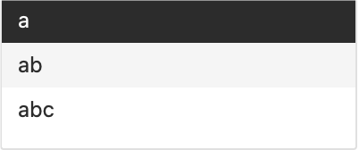
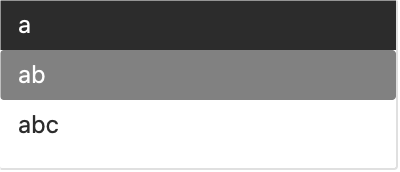

# 201_4
## 如何测试
暂时不检查，补全后补全框更新的位置是否正确，这部分有一个已知问题。

### 测试Inline与Popup补全模式的切换
1. 在正文中直接输入"a ab abc"
2. 菜单栏导航，Edit->Preferences，在General选项中有一项Completion style
3. 切换Completion style到Popup
4. 在正文的下一个单词输入a，然后按下tab
5. 检查：补全Popup窗口弹出
3. 切换Completion style到Inline
4. 在正文的下一个单词输入a，然后按下tab
5. 检查：补全Popup窗口没有弹出

### 测试Popup补全窗口的键盘响应(generic-edit环境)
1. 菜单栏导航，Edit->Preferences，在General选项中有一项Completion style
2. 切换Completion style到Popup
3. 在正文中直接输入"a ab abc"
4. 在正文的下一个单词输入a，然后按下tab
5. 检查：补全Popup窗口弹出
6. 输入b
7. 检查：Popup窗口中的内容更新为"ab"和“abc”
8. 输入c
9. 检查：Popup窗口关闭
10. 在正文的下一个单词输入a，然后按下tab
11. 反复按下键盘上、下箭头
12. 检查：循环插入选中的补全内容
13. 选中“ab”，按下回车键
14. 检查：Popup窗口关闭，ab被补全出来。
15. 按下tab键盘
16. 检查：Popup窗口重新打开，包括"ab"、“abc”两项
17. 按下空格键
18. 检查：Popup窗口关闭，且空格被插入
19. 按下Backspace删除空格键
20. 按下tab打开Popup
21. 按下Backspace删除ab中的b
22. 检查：Popup窗口中的内容更新为"a", "ab", "abc"
23. 按下esc
24. 检查：Popup窗口关闭，且再次按下tab无法打开补全框（前人设计的逻辑，但我不知道为什么这么设计）

### 测试Popup补全窗口的鼠标响应(generic-edit环境)
1. 菜单栏导航，Edit->Preferences，在General选项中有一项Completion style
2. 切换Completion style到Popup
3. 在正文中直接输入"a ab abc abd abe abf abg"
4. 在正文的下一个单词输入a，然后按下tab
5. 鼠标滚轮滚动编辑区
6. 检查：Popup窗口跟随编辑区滚动
7. 使用鼠标滚动Popup窗口区域
8. 检查：Popup窗口内容发生滚动，而编辑区不滚动
9. 使用鼠标点击一个补全项
10. 检查：补全项被插入到编辑区，且Popup窗口消失
11. 在正文的下一个单词输入a，然后按下tab
12. 鼠标点击滚动编辑区内任意位置（但是不要点到Popup窗口）
13. 检查：Popup窗口关闭，且再次按下tab可以打开补全框

### 测试Popup补全窗口的键盘响应和鼠标响应(program-edit环境)
流程同generic-edit环境的版本，只是第三步改为
3. 插入一段Python块，输入内容(例如re)。

### 测试 ref 补全部分情况正常删除字符
请见 `TeXmacs/tests/tmu/201_4_ref.tmu`

### 测试补全样式默认为 Popup
1. 关闭STEM，参照macOS测试流程，确保清空缓存
2. 打开STEM，插入'a ab abc'（不带引号）
3. 在新的一行插入'a'，然后按tab
4. 检查：Popup补全出现
5. 输出'$'进入数学模式，然后输入'e'，按下tab
6. 检查：数学补全出现

### 测试custom_complete不会出现多余补全项
1. 插入一个 Scheme 块
2. 输入`(is`，按下tab
3. 检查：Popup中的补全项，不包括`isis`

### 测试安全的 delete 操作
1. cmd-f 打开结构化搜索（也就是辅助窗口中的搜索）
2. 输入`\a`，此时补全框被触发（但由于目前未适配辅助窗口中的补全，补全框不可见，将来会正常显示）
3. 点击辅助窗口的 `x` 按钮关掉辅助窗口
4. 在主编辑区，再次 cmd-f 打开辅助窗口
5. 鼠标点一下辅助窗口编辑区
6. 检查：没有crash

### 测试补全框适配辅助窗口
1. cmd-f 进入结构化搜索
2. 输入`\a`
3. 检查：补全框出现在正确位置

### 测试修复在词内开始宏补全时补全框位置计算错误
1. 插入 `\abstract`，按 esc 关闭补全框
2. 按方向左键，移动到词内部
3. 删除一个字母，例如`s`
5. 检查：补全框弹出，且位置正确

## 2025/08/19 修复在词内开始宏补全时补全框位置计算错误
### What?
在进行光标向前进动时，添加 tp 的末尾大于 0 的条件，以处理在词内开始补全的情况。

### Why？
目前控制光标向前进动的条件为 `i < prefix_N`，也就是直接向前进动 N 次。在词尾启动补全时，这是正确的。

但是在词中启动补全时（此情况仅有宏补全会涉及），就会导致进动过度，光标移过目标位置。

### How？
添加添加 tp 的末尾大于 0 的条件。确保向前进动不会跳出当前块

## 2025/08/19 补全框适配辅助窗口
### What?
修改了计算补全框位置的代码，增加了一次相对位置的偏移。

### Why？
在主编辑区，其左侧与窗口左侧是永远对齐的，因此即使少了一次x相对位置的偏移也不会算错位置。

但在辅助窗口中的编辑区，其左侧与窗口左侧是有一定距离的，在确定补全框相对辅助组件的位置时，需要扣除这一部分距离。

### 已知问题
在补全项中间编辑补全项从而触发补全框时，补全框定位不正确，这大概是因为向前（左侧）进动光标的步数出现了错误。这一情况是普遍的（主编辑区、辅助窗口编辑区都存在），需要适配这一情况。

## 2025/08/19 使用更加安全的 delete 操作
### What
对 completionPopUp 和 mathCompletionPopUp 改用智能指针 QPointer，避免潜在的悬垂指针问题
对 completionPopUp 和 mathCompletionPopUp 使用了更加安全的 delete 操作.
具体的流程如下：
- 先hide
- 然后设置 parent 为空指针
- deleteLater 把删除操作放到事件循环末尾执行，保证当前调用栈和 Qt 内部事件处理不会访问已删除内存。
- 设置 completionPopUp 为空指针

### Why?
当补全框同时出现在主编辑区和辅助窗口时，关闭辅助窗口的补全框使得辅助窗口在进行内存管理时释放掉 completionPopUp，此时 completionPopUp变成 悬垂指针，导致重复删除造成段错误。

## 2025/08/12 修复custom_complete出现多余补全项
### How?
先前的逻辑中少了一句continue，现在添加回来.

## 2025/08/12 改进补全样式的设置项
## 2025/08/12 默认设置Popup为补全样式的设置项
### What
- 改进补全样式的设置项，添加了enum转换显示的文本和内部用的值，统一在内部使用小写"popup"和“inline”。
- 在`preferences-menu`中添加了补全样式相关enum。
- 调整了`preferences-widget`中"Inline"和"Popup"的先后顺序，默认使用Popup

### Why?
Quote: 富贵不归乡，如衣锦夜行

## 2025/08/11 fix: ref 补全部分情况无法删除字符
### What
修改了 complete_try 函数中 ref 相关的条件分支的逻辑。添加了确保“在补全结果中插入一个空值以保留前缀自身”的逻辑。

添加了“处于补全模式中且前缀为空时，返回正常模式”的逻辑。

### Why?
岩松在测试中发现，在补全 ref 时，有时按下 backspace 无法删除。

例如：ref中的补全结果为`auto-1`，现在按下 backspace 删除一次，得到`auto-`，然后继续按下backspace，就没有反应了。

这是因为，在补全模式下，每次进行编辑都会重新搜索新的补全，而在ref补全下，以`auto`为前缀获取到的补全均是以`auto-`开头的结果，而没有包括`auto`自己，这就导致每次从`auto-`删除后，程序以极快的速度从`auto`补全为`auto-`，就显得不能删除了。

### How
解决方法就是，确保在 ref 中的补全项包括前缀自身。这样每次删除触发新的补全结果为前缀自身，不会对删除操作造成干扰(与其他模式补全相同)。

同时，为了确保删除为空字符后，补全框可以正确地关闭，需要添加对应的关闭逻辑。

## 2025/07/29 fix: custom-complete时删除掉前缀补全框不关闭
### What
修改了custom-complete对于prefix定义的条件，使用一个辅助变量prefix_initialized来判断是否定义，而不是使用prefix自身。

### Why
补全项的第一项（补全中使用到的prefix）也可能是空字符串“”，这种情况发生时，如果使用`prefix != ""`来判断prefix是否初始化就不正确了。

### 如何测试
这块bug fix比较小，不写在上面的流程中了。
0. 确保 Completion style 设置为 Popup
1. 插入一个Scheme块
2. 插入一些可以补全的字符，例如"(a"
3. 按tab补全
4. 删除掉前缀，在这个例子里是"a"
5. 检查：补全框因前缀为空而消失


## 2025/07/18 令Popup补全模式下不显示消息
### What
移除了Popup补全模式下显示消息的代码。
添加了补全过程中显示消息的条件，仅当Inline模式时显示。

### 如何测试？
这块修改比较小，不写到上面的测试流程中了。
1. 菜单栏导航，Edit->Preferences，在General选项中有一项Completion style
2. 切换Completion style到Popup
3. 在正文中直接输入"a ab abc"
4. 在正文的下一个单词输入a，然后按下tab
5. 检查：底部message没有被清空
6. 不断按下tab触发循环
7. 检查：底部没有更新message

### Why
Darcy的建议。

## 2025/07/14 修改补全框的最小高度逻辑
### What
修改了补全框的最小高度的逻辑，适配当前字体大小，不再添加白边。
添加了额外的resize操作（每次updatePosition都进行resize）

### Why
Darcy、Yansong都有对白边感到困惑，说明这是一个不合理的设计。因此移除之。

### 如何测试
在仅有2-3个候选项的情况下打开补全框即可观察出区别。这部修改很小，不写在上面的测试流程中了。
1. 在正文中直接输入"a ab abc"
2. 在正文的下一个单词输入a，然后按下tab
3. 检查补全框下方是否还有空白空间

## 2025/07/17 liii主题中添加对补全框的适配
### What
在liii.css中添加了对补全框item:hover的的调整，使用较为深色的背景和白色文字
见图片
- 修改前

- 修改后


## 2025/07/14 添加补全框的Qt类与调用
### What
添加了实现补全框的Qt类，提供了补全框相关的Qt接口。

Public的接口有：
```
  同步滚动相关：
  void   scrollBy (int x, int y);
  void   setScrollOrigin (QPoint origin);
  同步选中项相关:
  void   selectNextItem ();        
  void   selectPreviousItem ();
  void   selectItemIndex (int index);
  同步位置相关：
  void   updatePosition ();
  void   updateCache (tree& et, box& eb, path tp, double magf, int scroll_x,
                      int scroll_y, int canvas_x, int index);
  显示补全框的接口：
  void   showCompletions (path tp, array<string>& completions, struct cursor cu,
                          double magf, int scroll_x, int scroll_y, int canvas_x);
```

添加了，在generic-edit、program-edit情况下对接口的调用。
添加了菜单选项，可以设定是否使用新的Popup窗口(暂时没有添加翻译，其他PR中添加吧)

### 已知问题
#### 在补全选项中循环的时候，补全窗口的定位有可能错误
复现步骤：
1. 确保Popup补全打开
2. 插入一个Scheme块
3. 输入(db-然后按下tab
4. 稍等几秒，scheme的补全词典返回比较慢
5. 看到补全框后，再次按下tab
6. 观察插入`(db-<gtr>bib`后补全框的位置，比正常的位置靠左了

这可能是特殊符号导致的
