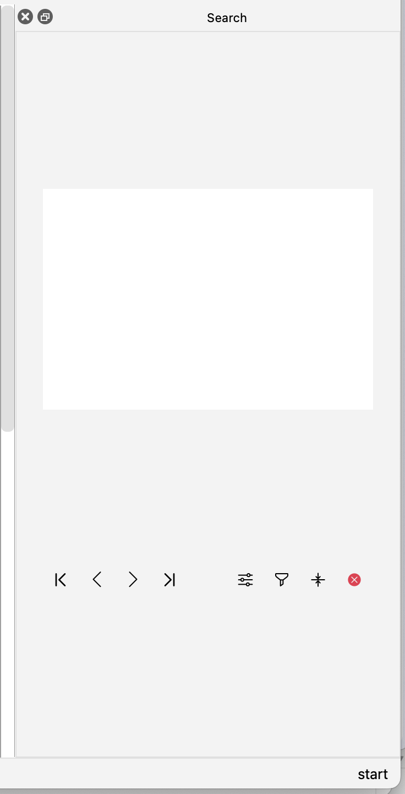

# 201_9 辅助组件
## 如何测试？
### 测试辅助窗口中的宏编辑
1. 插入宏，例如`\strong`
2. cmd-opt-e 打开宏编辑去（或者点击工具栏-扳手-edit macro）
3. 检查：宏编辑器打开在右侧辅助窗口中
4. 检查：宏编辑器的功能如初

### 测试辅助窗口组件和接口
1. 拆入一个Scheme会话
2. 定义一个Widget，例如一个显示 Hello world 的text_widget
```
(define hw-widget (widget-text "Hello world from QTMAuxiliaryWidget" 0 (color "blue") #t))
```
3. 设定辅助窗口
```
(set-auxiliary-widget hw-widget "Hello World Widget")
```
4. 展示辅助窗口
```
(show-auxiliary-widget #t)
```

### 测试 with-default-view 宏
2. cmd-f 打开查找，并且点击下方的按钮打开结构化查找
3. 确保光标处于结构化搜索的辅助窗口编辑区内
4. cmd-n 创建新buffer
5. 检查：新buffer被创建
1. 插入一些字符，用于辨识，例如"asd"
6. 确保光标处于结构化搜索的辅助窗口编辑区内
7. cmd-s 保存buffer
8. 检查：弹出保存框
9. 输入文件名，保存
6. 确保光标处于结构化搜索的辅助窗口编辑区内
7. cmd-w 关闭当前文档
8. 检查：文档被关闭（由于刚刚保存，应该没有弹窗）
6. 确保光标处于结构化搜索的辅助窗口编辑区内
10. cmd-o 打开文档
11. 检查：文件选择窗口弹出
12. 选中刚才保存的文档，确认
13. 检查：文档被打开
6. 确保光标处于结构化搜索的辅助窗口编辑区内
14. cmd-p preview文档
15. 检查：系统自带pdf查看器打开了文档的pdf预览，且内容为刚刚插入的字符，例如“asd”

### 测试在辅助窗口中按下 Esc 可关闭辅助窗口
1. cmd-f 打开搜索，点击下方的按钮打开结构化搜索
2. 鼠标点击一下结构化搜索辅助组件的任何一部分，可以是空白部分也可以是编辑区
3. 按下 Esc
4. 检查：辅助组件被隐藏

## 2025/08/13 在辅助窗口中按下 Esc 可关闭辅助窗口
### What
- 在 QTMAuxiliaryWidget 中添加了对键盘时间的监听。如果为 Escape 键则隐藏自身。
- 在 key_press 中添加了处理辅助窗口中按下 escape 键的逻辑。

### Why？
- 在 Qt 类中添加监听是为了实现在辅助组件的空白处按下 Esacpe 时候触发隐藏。
- 在 key_press 中添加逻辑是为了实现在辅助组件的编辑区中按下 Escape 键触发隐藏。此时事件被子组件截取，不会上传到 Qt 类中

## 2025/08/13 给 New, Load, Save, Save as, Preview, Close Document 操作应用 with-default-view
## 2025/08/13 实现 with-default-view 宏
### What
- 实现了 ensure-default-view 函数，作用为确保当前view的类型为default
- 实现了 with-default-view 宏，先ensure-default-view，然后延迟执行 body 中的语句。使用 exec-delayed 确保时间循环更新已完成。
- 给 New, Load, Save, Save as, Preview, Close Document 操作应用 with-default-view。现在在辅助窗口按下 cmd-n/cmd-t, cmd-s, cmd-shift-s, cmd-p, cmd-w，都会先跳转到辅助窗口的parent view，然后执行相应的语句。

### Why?
由于texmacs最初的设计没有考虑到一个窗口中有多个编辑区域，在辅助窗口/组件中也可以进行保存、打开文档等操作。而texmacs没有对此进行特殊处理或者适配，导致这些操作实际上是异常的。这种异常在先前版本中的结构化搜索窗口也可以观察到。

### How?
在执行相关操作时，检查当前 view 是否为 default view，来判断当前编辑区域是否为正常的编辑区域，如果不是，则跳转到父窗口。这样就确保了相关操作一定是在正常编辑区域执行的（目前只有父窗口-子窗口的一层关系）

### 可能的问题
目前只为file菜单中的有快捷键绑定的操作添加了with-default-view宏，而其他操作没有。事实上，用户处于辅助窗口时可以通过 file 菜单调用其他的操作，例如打印。这些操作将来也是需要包裹一层with-default-view宏的。

## 2025/08/13 实现并暴露 switch-to-parent-window 函数
### What
- 在 tm_window 中添加了 public 成员变量 url parent，用于记录父窗口
- 修改了创建 texmacs_input_widget 时构造 tm_window 的参数，添加父窗口
- 在 new_window.cpp 中实现了 switch_to_parent_window 函数
- 暴露了 switch_to_parent_window 为 switch-to-parent-window

### Why
将来进一步优化多缓冲区的编辑，尤其是“辅助窗口自动切换回父窗口编辑区”的操作，需要此函数。

### 关于测试
目前没有简单的方法测试，如果想要测试需要构造一些比较复杂的 Scheme 语句，然后在运行时中运行。为了简便目前不添加测试了。

将来的 PR 中会调用此函数，也就相当于测试了。


## 2025/07/29 将结构化替换放到辅助组件中
顺带调整了一下搜索输入区域的宽度使之与替换的输入区域统一，这部分修改太小了就不另外提PR了。

## 2025/07/23 修改辅助窗口的css样式表
### before


### after


## 2025/07/23 将结构化搜索放到辅助组件中

## 2025/07/23 将宏编辑放到辅助组件中
## 2025/07/23 添加设置组件标题的接口
### What
- 在`qt_tm_widget_rep::send`中添加了`SLOT_AUXILIARY_WIDGET`的case，用于处理辅助组件标题的设置
- 修改了`set-auxiliary-widget`的参数，添加了一个必须的参数`string name`作为辅助组件的标题
- 修改了宏编辑窗口的创建过程，使宏编辑窗口创建在辅助组件中


## 2025/07/21 初步实现辅助窗口组件和接口
### What?
初步实现了辅助窗口组件`QTMAuxiliaryWidget.cpp`，并提供了scheme接口`show-auxiliary-widget`和`set-auxiliary-widget`。

窗口是可以变成浮动窗口，并且拖拽的，但具体的细节（例如最小尺寸、位置限制）还没有实现。
